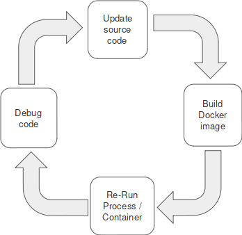
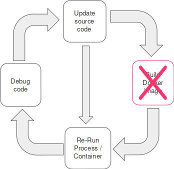
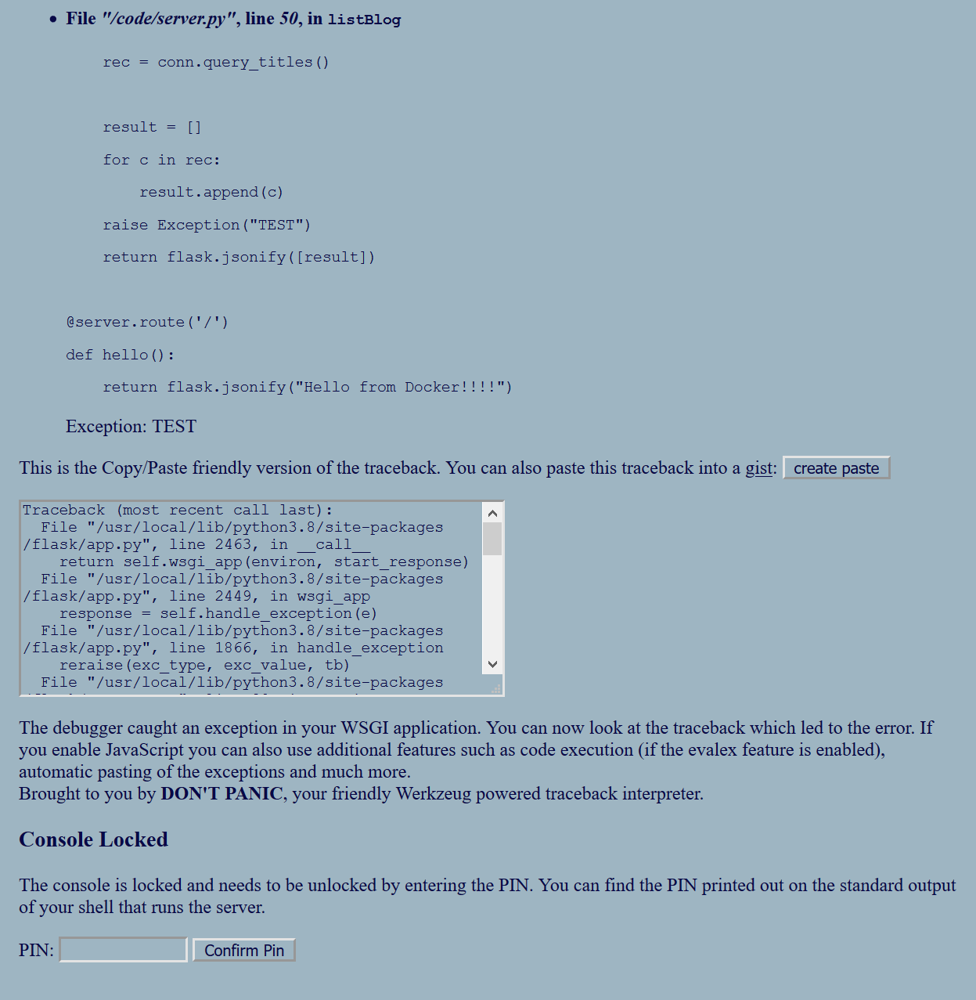
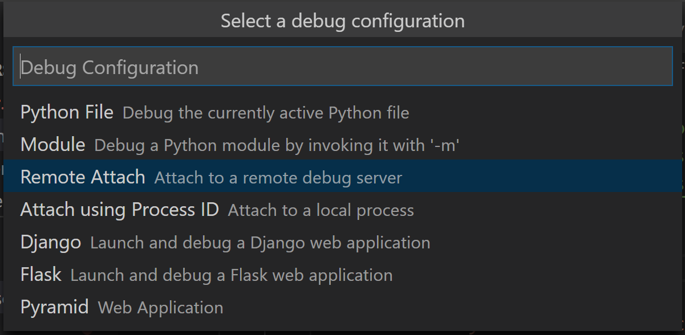

# Контейнерная разработка на Python - часть 3

Оригинал статьи: [Containerized Python Development – Part 3](https://www.docker.com/blog/containerized-python-development-part-3/)

Это последняя часть в серии сообщений в блоге, показывающих, как настроить и оптимизировать контейнерную среду разработки Python. В первой части рассказывалось о том, как контейнеризовать службу Python и о лучших практиках разработки для нее. Вторая часть показала, как легко настроить различные компоненты, необходимые нашему приложению Python, и как легко управлять жизненным циклом всего проекта с помощью Docker Compose.

В этой заключительной части мы рассмотрим цикл разработки проекта и более подробно обсудим, как применять обновления кода и отлаживать сбои контейнерных служб Python. Цель состоит в том, чтобы проанализировать, как ускорить эти повторяющиеся фазы процесса разработки, чтобы получить опыт, аналогичный опыту локальной разработки.

## Применение обновлений кода

В общем, наш цикл контейнерной разработки состоит из написания / обновления кода, сборки, запуска и отладки.



Что касается этапов сборки и выполнения, поскольку большую часть времени нам фактически приходится ждать, мы хотим, чтобы эти этапы проходили довольно быстро, чтобы мы сосредоточились на кодировании и отладке.

Теперь мы проанализируем, как оптимизировать этап сборки во время разработки. Фаза сборки соответствует времени сборки изображения, когда мы изменяем исходный код Python. Образ необходимо перестроить, чтобы получить обновления кода Python в контейнере перед его запуском.

Однако мы можем применить изменения кода без создания образа. Мы можем сделать это, просто подключив локальный исходный каталог к его пути в контейнере. Для этого мы обновляем файл набора следующим образом:

```yaml
# docker-compose.yml
...
  app:
    build: app
    restart: always
    volumes:
      - ./app/src:/code
... 
```

Благодаря этому у нас есть прямой доступ к обновленному коду, и поэтому мы можем пропустить сборку образа и перезапустить контейнер, чтобы перезагрузить процесс Python.



Кроме того, мы можем избежать повторного запуска контейнера, если запустим внутри него процесс перезагрузки, который отслеживает изменения файлов и запускает перезапуск процесса Python после обнаружения изменения. Нам нужно убедиться, что мы установили привязку исходного кода в файле Compose, как описано ранее.

В нашем примере мы используем фреймворк **Flask**, который в режиме отладки запускает очень удобный модуль, называемый **reloader**. Перезагрузчик просматривает все файлы исходного кода и автоматически перезапускает сервер, когда обнаруживает, что файл был изменен. Чтобы включить режим отладки, нам нужно только установить параметр отладки, как показано ниже:

```python
# server.py
server.run(debug=True, host='0.0.0.0', port=5000) 
```

Если мы проверим журналы контейнера приложения, мы увидим, что сервер **flask** работает в режиме отладки.

```bash
$ docker-compose logs app
Attaching to project_app_1
app_1 | * Serving Flask app "server" (lazy loading)
app_1 | * Environment: production
app_1 | WARNING: This is a development server. Do not use it in a production deployment.
app_1 | Use a production WSGI server instead.
app_1 | * Debug mode: on
app_1 | * Running on http://127.0.0.1:5000/ (Press CTRL+C to quit)
app_1 | * Restarting with stat
app_1 | * Debugger is active!
app_1 | * Debugger PIN: 315-974-099
```

После обновления исходного кода и сохранения мы должны увидеть уведомление в журналах и перезагрузиться.

## Отладка кода

Мы можем отлаживать код двумя способами.

Во-первых, это старомодный способ размещения операторов печати по всему коду для проверки значений объектов / переменных во время выполнения. Применять это к контейнерным процессам довольно просто, и мы можем легко проверить вывод с помощью команды **docker-compose logs**.

Во-вторых, более серьезный подход - использование отладчика. Когда у нас есть контейнерный процесс, нам нужно запустить отладчик внутри контейнера, а затем подключиться к этому удаленному отладчику, чтобы иметь возможность проверять данные экземпляра.

Мы снова возьмем в качестве примера наше приложение **Flask**. При работе в режиме отладки, помимо модуля перезагрузки, он также включает интерактивный отладчик. Предположим, мы обновляем код, чтобы вызвать исключение, служба **Flask** вернет подробный ответ с исключением.



Еще один интересный случай для упражнений - интерактивная отладка, когда мы помещаем точки останова в код и выполняем проверку в реальном времени. Для этого нам понадобится IDE с Python и поддержкой удаленной отладки. Если мы решим полагаться на **Visual Studio Code**, чтобы показать, как отлаживать код Python, работающий в контейнерах, нам нужно сделать следующее, чтобы подключиться к удаленному отладчику непосредственно из **VSCode**.

Во-первых, нам нужно локально отобразить порт, который мы используем для подключения к отладчику. Мы можем легко сделать это, добавив отображение порта в файл Compose:

```yaml
# docker-compose.yml
...
  app:
    build: app
    restart: always
    volumes:
      - ./app/src:/code
    ports:
      - 5678:5678
... 
```

Затем нам нужно импортировать модуль отладчика в исходный код и заставить его прослушивать порт, который мы определили в файле Compose. Мы не должны забывать также добавить его в файл зависимостей и перестроить образ для службы приложения, чтобы установить пакет отладчика. Для этого упражнения мы решили использовать пакет отладчика **ptvsd**, который поддерживает **VS Code**.

```python
# server.py
...
import ptvsd
ptvsd.enable_attach(address=('0.0.0.0', 5678))
... 
```

```bash
# requirements.txt
Flask==1.1.1
mysql-connector==2.2.9

ptvsd==4.3.2 
```

Нам нужно помнить, что для изменений, которые мы вносим в файл Compose, нам нужно запустить команду **compose down**, чтобы удалить текущую настройку контейнеров, а затем запустить **docker-compose up** для повторного развертывания с новыми конфигурациями в файле compose.

Наконец, нам нужно создать конфигурацию **«Remote Attach»** в **VS Code**, чтобы запустить режим отладки.



Файл **launch.json** для нашего проекта должен выглядеть так:

```javascript
{
    "version": "0.2.0",
    "configurations": [
        {
            "name": "Python: Remote Attach",
            "type": "python",
            "request": "attach",
            "port": 5678,
            "host": "localhost",
            "pathMappings": [
                {
                    "localRoot": "${workspaceFolder}/app/src",
                    "remoteRoot": "/code"
                }
            ]
        }
    ]
}
```

Нам нужно убедиться, что мы обновляем карту путей локально и в контейнере.

Как только мы это сделаем, мы сможем легко разместить точки останова в среде IDE, запустить режим отладки на основе созданной конфигурации и, наконец, запустить код для достижения точки останова.

## Заключение

В этой [серии сообщений в блоге](https://www.docker.com/blog/tag/python-env-series/) показано, как быстро настроить контейнерную среду разработки Python, управлять жизненным циклом проекта, применять обновления кода и отлаживать контейнерные службы Python. Применение на практике всего, что мы обсуждали, должно сделать опыт контейнерной разработки идентичным локальному.

## Ресурсы

* Образец проекта
  * [https://github.com/aiordache/demos/tree/master/dockercon2020-demo](https://github.com/aiordache/demos/tree/master/dockercon2020-demo)
* Лучшие практики для написания Dockerfile
  * [https://docs.docker.com/develop/develop-images/dockerfile\_best-practices/](https://docs.docker.com/develop/develop-images/dockerfile\_best-practices/)
  * [https://www.docker.com/blog/speed-up-your-development-flow-with-these-dockerfile-best-practices/](https://www.docker.com/blog/speed-up-your-development-flow-with-these-dockerfile-best-practices/)
* Docker Desktop
  * &#x20;[https://docs.docker.com/desktop/](https://docs.docker.com/desktop/)
* Docker Compose
  * &#x20;[https://docs.docker.com/compose/](https://docs.docker.com/compose/)
* Образцы шаблонов проекта
  * &#x20; [https://github.com/docker/awesome-compose](https://github.com/docker/awesome-compose)
