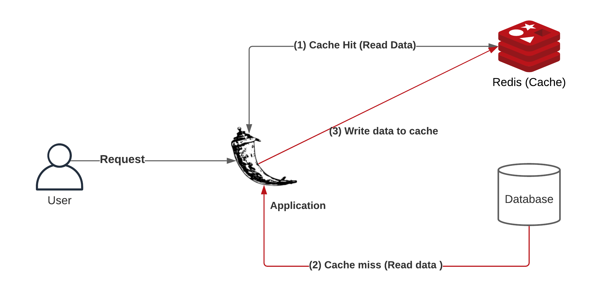
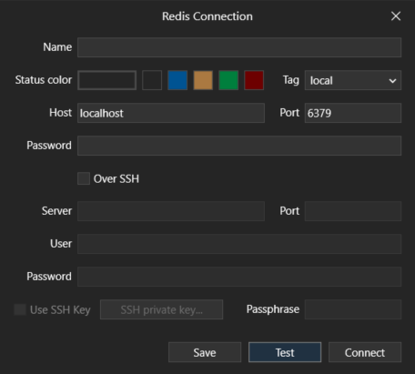
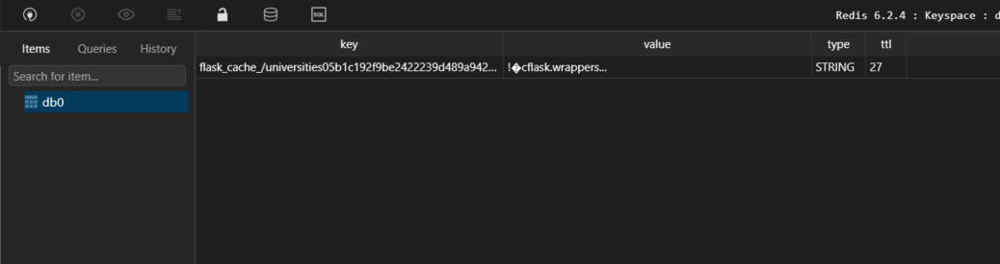

# Внедрение кэширования API с помощью Redis, Flask и Docker \[шаг за шагом]

Вы хотите, чтобы ваш API был быстрее, согласованнее и уменьшал количество запросов к серверу? - Вот тут-то и пригодится кеширование. В этой статье я покажу вам, как реализовать кеширование API с **Redis** на **Flask**. В качестве примера я беру Flask, но концепция кеширования одинакова, независимо от технологий.

Оригинал статьи [здесь](https://levelup.gitconnected.com/implement-api-caching-with-redis-flask-and-docker-step-by-step-9139636cef24).

## Что такое кеширование?

Прежде чем мы перейдем к практической части реализации кеширования с помощью **Redis** и **Flask**, давайте сначала узнаем, что такое кеширование как определение, и изучим его как концепцию, чтобы вы знали, каковы будут варианты использования.

Кэширование - это возможность хранить копии часто используемых данных в нескольких местах на пути запрос-ответ. Когда потребитель запрашивает представление ресурса, запрос проходит через кеш или серию кешей (локальный кеш, прокси-кеш или обратный прокси) к службе, на которой размещен ресурс. Если какой-либо из кешей на пути запроса имеет новую копию запрошенного представления, он использует эту копию для удовлетворения запроса. Если ни один из кешей не может удовлетворить запрос, запрос отправляется в службу (или на исходный сервер, как он формально известен). Это хорошо определяется двумя терминами: промахи в кэше и попадание в кеш.

Попадание в кэш - **cache hit** - это состояние, в котором данные, запрошенные для обработки компонентом или приложением, находятся в кэш-памяти. Это более быстрый способ доставки данных процессору, поскольку кэш уже содержит запрошенные данные.

Промах кэша - **cache miss** - это состояние, при котором данные, запрошенные для обработки компонентом или приложением, не найдены в кэш-памяти. Это вызывает задержки выполнения, требуя от программы или приложения выборки данных из других уровней кэша или из основной памяти.

Как упоминалось выше, есть несколько способов реализовать кеширование. Это может быть на стороне клиента через веб-кеширование, на стороне сервера через кеширование данных (реляционные базы данных, **Redis** и т. д.), Кэширование приложений через плагины, которые устанавливаются в приложении (например, плагины в WordPress). В этом руководстве мы собираемся использовать **Redis**, чтобы сохранять ответы от API, а затем использовать эти ответы вместо запросов к серверу для получения данных.

## Flask и Redis - реализация

#### Предпосылки:

* Docker & Docker-compose
* Flask
* Python 3.\*+

Мы собираемся использовать **docker** для изоляции наших сервисов, а затем **docker-compose** для согласования сервисов вместе (размещение их в одной сети, связь между ними, переменные среды и т. д.). Если вы не знаете о **Docker**, я предлагаю вам обратиться к официальной документации [здесь](https://docs.docker.com/).



## Настройка проекта

Создайте python **virtualenv** и установите **Flask**, **redis**, **flask-caching** и **requests**:

```bash
$ python -m venv venv
$ source venv/Scripts/activate
$ (venv) pip install Flask redis flask_caching requests
```

Наше приложение будет выглядеть примерно так:

```
/root
├── app.py                 - Application entrypoint
├── config.py              - Config file for Flask
├── docker-compose.yml     - Docker compose for app and redis
├── Dockerfile             - Dockerfile for Flask API
├── .env                   - Environment variables
```

Итак, давайте продолжим и создадим файлы, необходимые для этой установки:

```bash
$ touch Dockerfile docker-compose.yml .env
$ pip freeze > requirements.txt
$ touch config.py app.py
```

## Что мы собираемся реализовать?

Мы просто собираемся создать простую конечную точку, которая извлекает данные об университете из API университетов Hipolabs, и на основе страны, которую мы отправили в качестве параметра запроса, мы получаем список с университетами для указанной страны.

Давайте продолжим и создадим в **app.py** экземпляр **Flask** и используем его для создания конечной точки, которая будет извлекать данные из университетов.

```python
# app.py
from flask import Flask, request, jsonify
import requests

app = Flask(__name__)


@app.route("/universities")
def get_universities():
    API_URL = "http://universities.hipolabs.com/search?country="
    search = request.args.get('country')
    r = requests.get(f"{API_URL}{search}")
    return jsonify(r.json())


if __name__ == "__main__":
    app.run(debug=True, host="0.0.0.0", port=5000)
```

Таким образом, в основном, в зависимости от страны параметра запроса, он делает запрос к внешнему API и возвращает данные в формате **JSON**. Давайте попробуем:

```bash
$ export FLASK_APP=app.py      # Чтобы узнать, где живет ваше приложение Flask
$ export FLASK_ENV=development # Включите режим отладки
$ flask run
```

Я буду использовать [Postman](https://www.postman.com/) для отправки запроса, потому что я также хочу видеть время, которое требуется для обработки моего запроса.


Хорошо, теперь мы видим, что у нас есть результаты, и все работает нормально, за исключением случаев. С помощью красного цвета вы можете увидеть время, которое потребовалось для получения данных с этой конечной точки. Мы можем попробовать сделать один и тот же запрос несколько раз, и результат не изменится. Это потому, что мы всегда делаем новый запрос к серверу. Наша цель - минимизировать это и, как объяснялось в начале, делать меньше запросов к серверу. Так что давай сделаем это.

## Добавьте redis и докеризуйте приложение

Мы увидели, что локально он работает нормально, но теперь мы хотим реализовать кеширование, и для этого нам понадобится **Redis**. Здесь можно использовать несколько подходов:

* Установка **Redis** (официально совместим с Linux, а не с Windows, см. [здесь](https://redis.io/topics/introduction))
* Разместите экземпляр **Redis** и используйте его (например, экземпляр **Redis** на [Heroku](https://devcenter.heroku.com/articles/heroku-redis))
* Запустите экземпляр **Redis** с **Docker** (мы это делаем)

Мы собираемся докеризовать приложение и добавить **Redis** в качестве службы, чтобы мы могли легко общаться из нашего приложения. Давайте продолжим и напишем **Dockerfile** для приложения **Flask**:

```bash
# Dockerfile
FROM python:3.7
# Запускать команды из каталога /app внутри контейнера
WORKDIR /app
# Скопируйте требования из локального образа в докер-образ
COPY requirements.txt /app
# Установите зависимости в образе докера
RUN pip3 install -r requirements.txt --no-cache-dir
# Скопируйте всё из текущего каталога в образ
COPY . .
```

У нас нет [command](https://docs.docker.com/engine/reference/builder/#cmd) для запуска образа, так как я буду использовать **docker-compose** для запуска контейнеров. Давайте настроим **docker-compose** для запуска нашего приложения и **Redis**:

```yaml
# docker-compose.yml
version: '3'
services:
  api:
    container_name: flask-container
    build: .
    entrypoint: python app.py
    env_file:
      - .env
    ports:
      - '5000:5000'
  redis:
    image: redis
    container_name: redis-container
    ports:
      - "6379:6379"
```

Поэтому мы просто добавляем две службы: наше приложение и **Redis**. Для приложения мы открываем порт **5000** на вход и выход, а для **Redis** мы предоставляем **6379**. Теперь давайте запустим службы с помощью **docker-compose**.

```bash
$ docker-compose up -d --build 
```

Наши службы должны быть запущены и работать, и если мы снова пойдем и сделаем тот же запрос, что и выше, когда мы запускали приложение без **Docker**, у нас будет такой же результат. Чтобы проверить, запущены ли службы, введите следующую команду:

```bash
$ docker ps
```

Теперь давайте настроим наше приложение для подключения к экземпляру **Redis**, а также для реализации кеширования в нашей конечной точке. Мы можем пойти прямо и установить переменные прямо в коде, но здесь я пытаюсь показать вам некоторые передовые практики при разработке с помощью **Flask** и **Docker**. В **docker-compose** из приведенной выше сути мы видим, что для переменных среды я ссылаюсь на файл **.env**, а затем использую **config.py** для сопоставления этих переменных с приложением **Flask**. Чтобы библиотека **flask-caching** работала, нам нужно установить некоторые переменные среды, которые предназначены для подключения **Redis** и типа кеширования. Вы можете узнать больше о [конфигурации из документации библиотеки](https://flask-caching.readthedocs.io/en/latest/#configuring-flask-caching), в зависимости от типа кэширования, который вы хотите реализовать.

```bash
# .env
CACHE_TYPE=redis
CACHE_REDIS_HOST=redis
CACHE_REDIS_PORT=6379
CACHE_REDIS_DB=0
CACHE_REDIS_URL=redis://redis:6379/0
CACHE_DEFAULT_TIMEOUT=500
```

В **.env** мы устанавливаем некоторые переменные, такие как тип кэширования, хост, БД и т. д. Поскольку эти переменные смонтированы из **docker-compose** внутри нашего контейнера, теперь мы можем получить эти переменные с помощью модуля **os**. Давайте возьмем эти переменные в **config.py**, и мы будем использовать их позже, чтобы сопоставить значения с нашим приложением **Flask**.

```python
# config.py
import os

class BaseConfig(object):
    CACHE_TYPE = os.environ['CACHE_TYPE']
    CACHE_REDIS_HOST = os.environ['CACHE_REDIS_HOST']
    CACHE_REDIS_PORT = os.environ['CACHE_REDIS_PORT']
    CACHE_REDIS_DB = os.environ['CACHE_REDIS_DB']
    CACHE_REDIS_URL = os.environ['CACHE_REDIS_URL']
    CACHE_DEFAULT_TIMEOUT = os.environ['CACHE_DEFAULT_TIMEOUT']
```

С точки зрения конфигурации у нас все хорошо. Теперь давайте инициализируем кеш поверх **Flask** и интегрируем его с нашим приложением.

```python
# app.py
import requests
from flask import Flask, jsonify, request
from flask_caching import Cache  # Импортируем Cache из модуля flask_caching

app = Flask(__name__)
app.config.from_object('config.Config')  # Установим переменные конфигурации для приложения
cache = Cache(app)  # Инициализируем Cache


@app.route("/universities")
@cache.cached(timeout=30, query_string=True)
def get_universities():
    API_URL = "http://universities.hipolabs.com/search?country="
    search = request.args.get('country')
    r = requests.get(f"{API_URL}{search}")
    return jsonify(r.json())
```

Мы добавили новый декоратор, который называется **@cache.cached**, затем мы указываем **timeout**, который представляет собой время, в течение которого этот ответ будет кэшироваться в памяти **Redis**. Таким образом, в основном после первого запроса мы будем хранить этот ответ в течение 30 секунд, после чего будет новый запрос, который снова обновит память. Второй параметр - **`query_string`**` ``= True`, что в этом случае имеет смысл, потому что мы хотим хранить ответы на основе строки запроса, которую мы храним, а не статического пути.

**query\_string** - по умолчанию **False**. Когда **True**, используемый ключ кеша будет результатом хеширования параметров упорядоченной строки запроса. Это позволяет избежать создания разных кешей для одного и того же запроса только потому, что параметры были переданы в другом порядке.

И мы закончили, давайте снова создадим контейнеры и протестируем это в действии с кешированием.

```bash
docker-compose up -d --build
```

Теперь давайте снова вернемся к Postman и сделаем тот же запрос на конечной точке университетов.


Впервые у нас будет примерно столько же времени, сколько было, когда мы не использовали кеширование, но если мы сделаем тот же запрос снова, у нас будут значительные улучшения, и все это благодаря **Redis**. Итак, что мы делаем, мы сохраняем ответ в базе данных в памяти, а затем, пока данные все еще хранятся там, они будут возвращены оттуда, вместо того, чтобы делать запрос с сервера.

Погрузимся глубже? - Давайте посмотрим, как это работает, используя инструмент с графическим интерфейсом для запроса нашего хранилища **Redis**. Я использую [TablePlus](https://tableplus.com/) для визуализации, но вы также можете использовать **Redis CLI** для запроса данных. Чтобы подключиться к нашему экземпляру **redis**, мы укажем **host** как **localhost**, а затем для порта мы введем **6379**, как мы показали в **docker-compose**.



После этого мы можем увидеть данные, которые хранятся в нашем экземпляре **Redis**. Когда ответ сохранен, вы можете увидеть **db0**, а если мы поищем больше, мы увидим наш кешированный ответ, включающий `[key; value; type; ttl]`.



Мы ясно видим, что кэшированный ответ - это **/university?\*** И доступен в то время, которое указано в **ttl**. Этот раздел был немного за рамками, но полезно знать, что происходит в фоновом режиме.

Итак, мы реализовали кеширование **API** с помощью **Redis** и **Flask**. Для получения дополнительных сведений обратитесь к [документации](https://flask-caching.readthedocs.io/en/latest/) библиотеки кэширования **Flask**, которая является оболочкой для реализации кеширования для разных клиентов.

## Выводы

Итак, мы реализовали кеширование **API** с помощью **Redis**. Это простой пример, но он включает много деталей по этой теме. Кэширование действительно важно при написании приложений, так как оно сильно влияет на производительность, и, когда это возможно, вам следует его реализовать, но убедитесь, что вы ориентируетесь на правильный вариант использования.

Вы можете найти полный исходный код статьи в [репозитории GitHub](https://github.com/vjanz/flask-cache-redis) с инструкциями.

Если вы нашли это полезным, не забудьте аплодировать и поделиться в своей социальной сети или с друзьями.

Если у вас есть какие-либо вопросы, не стесняйтесь обращаться ко мне.

Свяжитесь со мной в: [LinkedIn](https://www.linkedin.com/in/valon-januzaj-b02692187/), [GitHub](http://www.github.com/vjanz)

## Использованная литература

[https://www.cloudflare.com/learning/cdn/what-is-caching/](https://www.cloudflare.com/learning/cdn/what-is-caching/)\
[https://redislabs.com](https://redis.com/)\
[https://docs.docker.com/](https://docs.docker.com/)\
[https://flask-caching.readthedocs.io](https://flask-caching.readthedocs.io/en/latest/)\
[http://universities.hipolabs.com/](http://universities.hipolabs.com/)
