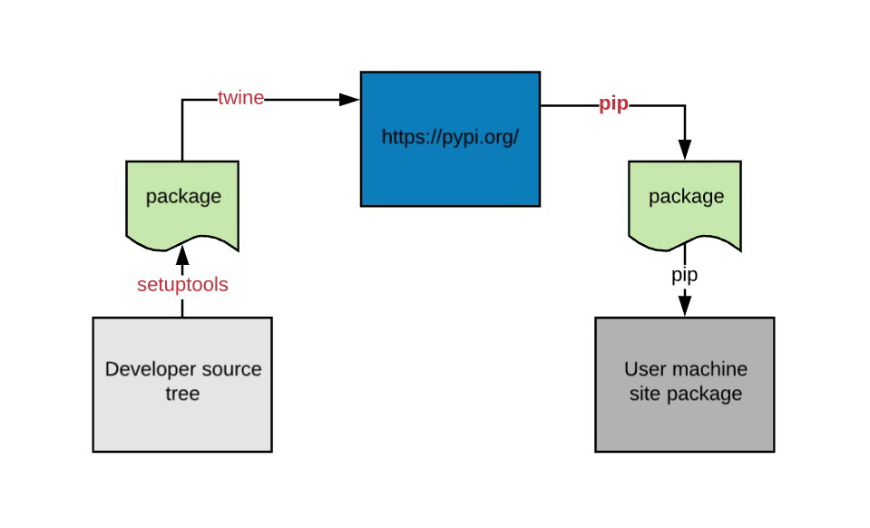

# Состояние упаковки Python

Оригинал статьи [Bernat Gabor](https://github.com/gaborbernat): [The state of Python Packaging](https://www.bernat.tech/pep-517-and-python-packaging/) от 7-02-2019.

Описывает, где упаковка Python находится сегодня, и куда, как надеется Python, будет двигаться дальше. В этом посте узнайте о типах пакетов.

**pip 19.0** был выпущен 22 января 2019 года. В списке функций наиболее заметно теперь он поддерживает **PEP-517**, который по умолчанию включен, если у проекта есть `pyproject.toml` в корневой папке. Рассматриваемый PEP был создан в 2015 году и принят в 2017 году. Несмотря на то, что на то, чтобы **pip** внедрил его, потребовалось некоторое время, выпуск и последующие проблемы подтвердили, что многие люди вообще с ним не знакомы. Читайте дальше, если вы хотите получить представление о том, как развивалась экосистема упаковки Python на сегодняшний день и где мы надеемся увидеть это в будущем. Мы надеемся, что даже несмотря на то, что введение вышеупомянутого предложения по усовершенствованию Python может вызвать некоторый дискомфорт в данный момент, мы извлечем из этого пользу в долгосрочной перспективе.

Я присоединился к сообществу Python с открытым исходным кодом около трех лет назад (хотя использовал его более 8 лет). С первых дней я заметил, что упаковка Python имеет репутацию своего рода черного ящика. Там много неизвестного, и люди в основном просто копируют конфигурации сборки других проектов и продолжают работать с ними. На моем пути к тому, чтобы лучше понять этот черный ящик и попытаться улучшить его, я стал сопровождающим как **virtualenv**, так и проекта **tox**, время от времени участвуя как в **setuptools**, так и в **pip**.

Поскольку я надеюсь дать исчерпывающий (надеюсь, все еще довольно высокий уровень) обзор предмета, я решил разделить его на три сообщения. В этом первом посте я дам общий обзор того, как работает упаковка Python, а также типы пакетов, которые она имеет. В следующем посте я подробно расскажу, как работает установка пакетов, и как **PEP-517/518** пытается ее улучшить. Наконец, я посвящаю целый другой пост, чтобы представить некоторые болезненные уроки, которые мы извлекли, внедряя эти улучшения. В первую очередь, я сосредоточусь в основном на системах Python Packaging Authorities (**pip**, **setuptools**, поэтому никаких упаковщиков для **conda** или операционной системы).

## Пример проекта

Чтобы рассказать эту историю, мне нужно рассказать историю о том, как распространять пакеты python; более конкретно объяснить, как установка пакетов работала в прошлом и как мы надеемся, что она будет работать в будущем. Чтобы иметь конкретный пример того, что нужно продемонстрировать, позвольте мне представить мою замечательную библиотеку примеров: **pugs**. Эта библиотека достаточно проста: она просто генерирует единственный пакет, называемый **pugs**, который содержит только один модуль, называемый **logic**. Логика состоит в том, чтобы генерировать случайные цитаты, как вы угадали, о мопсах. Вот простой пример его структуры, рассматриваемой как дерево исходных текстов (также доступно в [gaborbernat/pugs](https://github.com/gaborbernat/pugs)):

```bash
pugs-project
├── README.rst
├── setup.cfg
├── setup.py
├── LICENSE.txt
├── src
│   └── pugs
│       ├── __init__.py
│       └── logic.py
├── tests
│   ├── test_init.py
│   └── test_logic.py
├── tox.ini
└── azure-pipelines.yml
```

Здесь у нас есть четыре различных типа контента:

Что будет означать, если наш пакет **pugs** будет доступен в интерпретаторе пользовательской машины? В идеале пользователь должен иметь возможность импортировать его и вызывать из него функции после запуска интерпретатора:

* код бизнес-логики (что находится внутри папки `src`),
* тестовый код (папка `tests` и `tox.ini`),
* код упаковки и метаданные (`setup.py`, `setup.cfg`, `LICENSE.txt`, `README.rst` - обратите внимание, что в настоящее время мы используем де-факто стандартный инструмент для создания пакетов [setuptools](https://pypi.org/project/setuptools/)),
* файлы, помогающие в управлении и обслуживании проектов:
  * непрерывная интеграция (`azure-pipelines.yml`)
  * контроль версий (`.git`)
  * управление проектом (например, потенциальная папка `.github`).

```bash
Python 3.7.2 (v3.7.2:9a3ffc0492, Dec 24 2018, 02:44:43)
[Clang 6.0 (clang-600.0.57)] on darwin
Type "help", "copyright", "credits" or "license" for more information.
>>> import pugs
>>> pugs.do_tell()
"An enlightened pug knows how to make the best of whatever he has to work with - A Pug's Guide to Dating -  Gemma Correll"
```

## Доступность пакета Python

Как Python узнает, что доступно, а что нет? Короткий ответ - нет. По крайней мере, не заранее. Вместо этого он попытается загрузиться и посмотреть, удастся ли ему динамически. Откуда он его загружает? Есть много возможных мест, но в большинстве случаев мы говорим о загрузке из папки в файловой системе. Где эта папка? Для данного модуля можно распечатать представление модуля, чтобы узнать:

```bash
>>> import pugs
>>> pugs
<module 'pugs' from '/Users/bernat/Library/Python/3.7/lib/python/site-packages/pugs/__init__.py'>
```

Папка, которую вы найдете, зависит от:

* тип пакета (сторонний или встроенный/также известный как часть стандартной библиотеки)
* доступен глобально или только для текущего пользователя (см. [PEP-370](https://www.python.org/dev/peps/pep-0370/)),
* и это системный python или виртуальная среда.

Вообще говоря, для данного интерпретатора python можно найти список возможных каталогов, распечатав содержимое переменных `sys.path`, например, на моем MacOS:

```bash
>>> import sys
>>> print('\n'.join(sys.path))
/Library/Frameworks/Python.framework/Versions/3.7/lib/python37.zip
/Library/Frameworks/Python.framework/Versions/3.7/lib/python3.7
/Library/Frameworks/Python.framework/Versions/3.7/lib/python3.7/lib-dynload
/Users/bernat/Library/Python/3.7/lib/python/site-packages
/Library/Frameworks/Python.framework/Versions/3.7/lib/python3.7/site-packages
```

Для сторонних пакетов это будет папка `site-packages`. Обратите внимание, что в приведенном выше примере есть пример для всей системы и для конкретного пользователя. Как пакеты попадают в эту папку? Его должен там поставить какой-нибудь установщик.

На следующей диаграмме показано, как идут дела в большинстве случаев:



1. Разработчик записывает код Python внутри папки (называемой деревом исходных текстов).
2. Затем некоторый инструмент (например, **setuptools**) берет дерево исходных текстов и упаковывает его для распространения.
3. Сгенерированный пакет загружается через другой инструмент (**twine**) в центральный репозиторий (обычно [https://pypi.org](https://pypi.org)), к которому у конечного пользователя есть доступ.
4. Машина конечного пользователя использует некоторый установщик, который обнаруживает, загружает и устанавливает рассматриваемый пакет. Операция установки сводится к созданию правильной структуры каталогов и метаданных внутри папки **site-packages**.

## Типы пакетов Python

Пакет во время установки должен генерировать по крайней мере два типа содержимого, которое будет помещено в пакет сайта: папку с метаданными о содержимом пакета, `{package} - {version} .dist-info` и файлы бизнес-логики.

```bash
/Users/bgabor8/Library/Python/3.7/lib/python/site-packages/pugs
├── __init__.py
├── __pycache__
│   ├── __init__.cpython-37.pyc
│   └── logic.cpython-37.pyc
└── logic.py

/Users/bgabor8/Library/Python/3.7/lib/python/site-packages/pugs-0.0.1.dist-info
├── INSTALLER
├── LICENSE.txt
├── METADATA
├── RECORD
├── WHEEL
├── top_level.txt
└── zip-safe
```

Папка с информацией о распространении описывает пакет: какой установщик был использован для его размещения, с какой лицензией пакет был прикреплен к нему, какие файлы были созданы в процессе установки, что такое пакет python верхнего уровня, какие точки входа в пакет выставляет и т.д. Хорошее описание каждого файла можно найти в [PEP-427](https://www.python.org/dev/peps/pep-0427/#id14).

Как перейти от нашего исходного дерева к этим двум типам контента? Перед нами два разных пути:

1. Сгенерируйте эту структуру каталогов и метаданные из нашего исходного дерева, сожмите его в один файл и опубликуйте в центральном репозитории пакетов. В этом случае установщик должен загрузить пакет и распаковать его в папку **site-packages**. Мы называем этот тип упаковки **wheel**.
2. В качестве альтернативы вы можете создать архив, содержащий источник пакета, сценарии сборки и метаданные, необходимые для создания устанавливаемой структуры каталогов, а затем загрузить его в центральный репозиторий. Это называется исходным кодом или **sdist**. В этом случае у установщика намного больше работы, он должен распаковать архив, запустить построитель и только потом скопировать его.

Разница между двумя вариантами в основном заключается в том, где происходит операция компиляции/сборки пакета: на машине разработчиков или на машине конечных пользователей. Если это происходит на стороне разработчиков (например, в случае с **wheel**), процесс установки очень легкий. Со стороны машины разработчика все уже сделано. Операция на стороне пользовательского компьютера - это просто загрузка и распаковка.

В нашем случае мы использовали **setuptools** в качестве нашего конструктора (часть, которая генерирует из исходного дерева контент, который будет помещен в папку **site-packages**). Следовательно, чтобы выполнить операцию сборки на пользовательском компьютере, нам необходимо убедиться, что **соответствующая** версия **setuptools** доступна на пользовательском компьютере (если вы используете функцию из версии `40.6.0`, вы должны гарантировать, что у пользователя есть по крайней мере та версия).

Другой вариант использования, который следует учитывать, заключается в том, что Python предлагает возможность доступа к библиотекам C/C++ изнутри python (для получения этой дополнительной производительности там, где она вам нужна). Пакеты, которые делают это, называются пакетами C-extension, поскольку они используют преимущества C-extension API CPython.

Для работы таких расширений необходимо, чтобы C/C++ скомпилировал их функциональность как с библиотекой C/C++, с которой они взаимодействуют, так и с текущей библиотекой C-API интерпретаторов Python. В этих случаях операция сборки фактически включает вызов бинарного компилятора, а не только создание метаданных и структуры папок, как это было в случае с чистыми пакетами Python (такими, как наша библиотека **pugs**).

Если сборка происходит на пользовательской машине, необходимо убедиться, что правильные библиотеки и компиляторы также доступны во время сборки. Теперь это намного сложнее, поскольку это двоичные файлы для конкретной платформы, которые распространяются с помощью инструментов упаковки платформы. Отсутствие или несовпадение версий этих библиотек часто вызывает загадочные ошибки во время сборки, что оставляет пользователей разочарованными и озадаченными.

Поэтому по возможности всегда лучше упаковывать свою посылку в виде **wheel**. Это в целом позволит избежать проблемы пользователей, которые не имеют всех правильных зависимостей сборки (как чистых типов Python, таких как **setuptools**, так и двоичных, как компилятор C/C++). Даже если эти зависимости сборки легко настроить (например, в случае чистых сборщиков Python - например, **setuptools**), вы можете сэкономить время установки, полностью избегая этого шага.

При этом это все еще два варианта использования, которые гарантируют предоставление исходных дистрибутивов (даже если вы предоставляете **wheel**):

1. Дистрибутивы исходного кода C-extension, как правило, более поддаются аудиту, поскольку можно читать исходный код и, таким образом, обеспечивать большую прозрачность того, что он предлагает: многие крупные корпоративные среды предпочитают использовать их поверх **wheel** по этой единственной причине (обычно они распространяют правило на чистый Python **wheel** тоже, в основном, чтобы избежать необходимости категоризировать, что является чистым **wheel** python, а что нет).
2. Возможно, вы не сможете предоставить **wheel** для каждой возможной платформы (особенно это верно в случае пакетов c-extension), в этом случае исходный код может позволить этим платформам самостоятельно генерировать **wheel**.

## Заключение

Разница между деревом исходных текстов (source tree), дистрибутивом исходного кода (source distribution) и колесом (wheel):

* **source tree** - содержит все файлы проекта, доступные на машине/репозитории разработчика (бизнес-логика, тесты, данные упаковки, файлы CI, файлы IDE, SVC и т. д.) - например, см. пример проекта выше.
* **source distribution** - содержит файлы кода, необходимые для создания **wheel** (бизнес-логика + данные упаковки + часто также файлы модульных тестов для проверки сборки; особенно не хватает содержимого среды разработчика, такого как файлы CI/IDE/контроля версий) - формат: `pugs-0.0.1. tar.gz`.
* **wheel** - содержит метаданные пакета и исходные файлы, которые необходимо поместить в папку пакетов сайта - формат: `pugs-0.0.1-py2.py3-none-any.whl`.

Прочтите [следующий пост](upakovka-python-proshloe-nastoyashee-budushee.md) этой серии, чтобы узнать, что происходит, когда мы устанавливаем пакет. Спасибо за прочтение!
