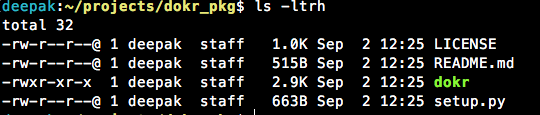

# Создайте свой первый пакет pip

Оригинал статьи Deepak Kumar: [Build Your First pip Package](https://dzone.com/articles/executable-package-pip-install) от 19-09-2018.

Если вы работаете на Python, вам нужно понимать **pip**. В этом посте мы рассмотрим, как создать и опубликовать пакет **pip**. Пип-пип-ура!

В этом руководстве мы узнаем, как создать пакет Python/pip. Если ваши требования соответствуют любому из них, это руководство для вас.

* Вы хотите сделать свою платформу сценариев независимой.
* Вы не хотите копировать исполняемый скрипт в каждую нужную вам систему.
* Вы хотите сделать свои скрипты Python общедоступными для всех и хотите помочь сообществу.

Мы используем **pip** для достижения того же. Мы сможем легко установить скрипт Python (в комплекте с пакетом **pip**) в любой системе после выполнения этого руководства. Код этого руководства доступен на **GitHub** [здесь](https://github.com/javatechy/dokr), а пакет pip - [здесь](https://pypi.org/project/dokr/).


Проверено с Python 2 и Python 3 в \*nix и Windows.


## 1. Зарегистрируйтесь

Сообщество Python поддерживает репозиторий, аналогичный [npm](https://www.npmjs.com/), для пакетов с открытым исходным кодом. Если вы хотите сделать свой пакет общедоступным, вы можете загрузить его на PyPi. Итак, прежде всего зарегистрируйтесь на PyPi: [https://pypi.org/account/register/](https://pypi.org/account/register/).

Я предполагаю, что у вас есть учетная запись [**GitHub**](https://github.com/), куда вы загрузите код своего пакета. Если вы хотите сохранить конфиденциальность своего пакета, пропустите этот шаг. Мы будем использовать `README.md` непосредственно из вашего проекта **GitHub** для этого руководства, и он будет использоваться в качестве документации вашего пакета.

## 2. Проверка необходимых инструментов

Убедитесь, что в вашей системе установлены Python и pip. Чтобы проверить установки:

```bash
python -V # для версии Python (2/3)
python -m pip --version
```

Приведенные выше команды должны дать вам правильный вывод версии. Если нет, установите Python и pip в свою систему.

Установите необходимые пакеты:

* **setuptools** - это библиотека процесса разработки пакетов, предназначенная для создания и распространения пакетов Python.
* **wheel** - Пакет [wheel](https://pypi.org/project/wheel/) предоставляет команду **bdist\_wheel** для **setuptools**. Он создает файл `.whl`, который можно установить напрямую с помощью команды `pip install`. Затем мы загрузим тот же файл на [pypi.org](https://pypi.org/).
* **twine** - Пакет [twine](https://pypi.org/project/twine/) обеспечивает безопасное, аутентифицированное и проверенное соединение между вашей системой и [PyPi](https://pypi.org/) через [HTTPS](https://en.wikipedia.org/wiki/HTTPS).
* **tqdm** - Это интеллектуальный индикатор прогресса, используемый twine внутри компании.

```bash
sudo python -m pip install --upgrade pip setuptools wheel
sudo python -m pip install tqdm
sudo python -m pip install --user --upgrade twine
```

## 3. Настройка вашего проекта

Создайте пакет, скажем, **dokr\_pkg**.



Создайте исполняемый файл внутри пакета, скажем, **dokr**. Создайте скрипт и без расширений (**dokr**).

```bash
#!/usr/bin/env python

echo "hey there, this is my first pip package"
```

Сделайте свой скрипт исполняемым.

```bash
chmod +x dokr
```

Создайте в своем пакете установочный файл `setup.py`. Этот файл будет содержать всю информацию о метаданных вашего пакета.

```python
import setuptools

with open("README.md", "r") as fh:
    long_description = fh.read()

setuptools.setup(
    name='dokr',
    version='0.1',
    scripts=['dokr'],
    author="Deepak Kumar",
    author_email="deepak.kumar.iet@gmail.com",
    description="A Docker and AWS utility package",
    long_description=long_description,
    long_description_conyent_type="text/markdown",
    url="https://github.com/javatechy/dokr",
    packages=setuptools.find_packages(),
    classifiers=[
        "Programming Language :: Python :: 3",
        "License :: OSI Approved :: MIT License",
        "Operating System :: OS Independent",
    ],
)
```

Ниже приводится информация о метаданных:

| Метаданные                          | Описание                                                                                                                     |
| ----------------------------------- | ---------------------------------------------------------------------------------------------------------------------------- |
| **name**                            | Имя вашего пакета.                                                                                                           |
| **version**                         | Текущая версия вашего пакета в **pip**.                                                                                      |
| **scripts**                         | Список исполняемых файлов. Рекомендуется оставить их такими же, как имя вашего пакета **pip**. Здесь мы используем **dokr**. |
| **author and author\_email**        | Имя и адрес электронной почты автора.                                                                                        |
| **description**                     | Краткое описание пакета.                                                                                                     |
| **long\_description**               | Описание пакета.                                                                                                             |
| **`long_description_content_type`** | Более подробное описание. Вот это markdown. Мы выбираем README.md для длинного описания.                                     |
| **packages**                        | Используйте для других зависимостей пакета.                                                                                  |
| **classifiers**                     | Содержит все классификаторы вашего проекта.                                                                                  |

Добавьте ЛИЦЕНЗИЮ в свой проект, создав файл с именем **LICENSE**. Образец лицензии доступен [здесь](https://github.com/javatechy/dokr/blob/master/LICENSE).

## 4. Компиляция вашего пакета

Зайдите в папку своего пакета и выполните эту команду: `python setup.py bdist_wheel`. Это создаст такую структуру:


* **build** - информация о пакете сборки.
* **dist** - Содержит ваш `.whl` файл. Файл **WHL** - это пакет, сохраненный в формате **Wheel**, который является стандартным форматом встроенных пакетов, используемым для дистрибутивов Python. Вы можете напрямую установить файл `.whl` с помощью `pip install some_package.whl` в вашей системе
* **project.egg.info** - Пакет **egg** содержит скомпилированный байт-код, информацию о пакете, ссылки зависимостей и фиксирует информацию, используемую командой `setup.py test` при запуске тестов.

## 5. Установить на свой локальный компьютер

Если вы хотите протестировать свое приложение на локальном компьютере, вы можете установить файл `.whl` с помощью **pip**:

```bash
python -m pip install dist/dokr-0.1-py3-none-any.whl
```

## 6. Загрузить на pip

* Создать `.pypirc`: файл [Pypirc](https://docs.python.org/2.5/dist/pypirc.html) хранит информацию репозитория **PyPi**. Создайте файл в домашнем каталоге
  * для Windows:  `C:\Users\UserName\.pypirc`
  * для \*nix:  `~/.pypirc`
* И добавьте к нему следующий контент. Замените **javatechy** своим именем пользователя.

```bash
[distutils]
index-servers=pypi

[pypi]
repository = https://upload.pypi.org/legacy/
username = javatechy
```

* Чтобы загрузить файл `dist/*.whl` на PyPi, используйте Twine:

```bash
python -m twine upload dist/*
```

Эта команда загрузит ваш пакет в PyPi. Этот учебный пакет доступен [здесь](https://pypi.org/project/dokr/).

## 3. Заключение

Мы узнали, как установить и создать пакет **pip** и сделать его доступным для всех. Этот пакет можно легко установить на любой компьютер, на котором есть **pip**, с помощью следующих команд:


Исходный код можно найти на [GitHub](https://github.com/javatechy/dokr), а пакет pip - на [PyPi](https://pypi.org/project/dokr/).

Если вам понравился этот пост, ознакомьтесь со статьей Дипака о [Dockerizing Spring Boot Application](https://dzone.com/articles/dockerizing-spring-boot-application-1).
