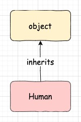
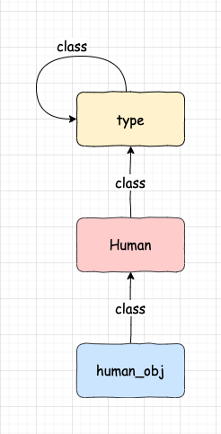
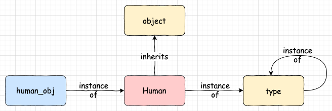
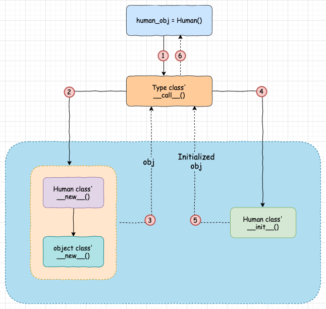

# Понимание создания объектов и метаклассов


Оригинал статьи находиться [здесь](https://www.honeybadger.io/blog/python-instantiation-metaclass/).

Автор: [Rupesh Mishra](https://www.honeybadger.io/blog/python-instantiation-metaclass/#authorDetails)

Дата: 25 ноября 2020


Если вы переходите на Python с другого языка, то вполне нормально чувствовать себя немного запутанным в отношении создания объектов и наследования, особенно когда люди начинают говорить о «метаклассах». В этой статье Рупеш Мишра объясняет, как создание экземпляров, наследование и даже метаклассы работают в Python.

**В этой статье мы рассмотрим процесс инстанцирования объектов**, за которым следует внутренний Python для создания объектов. Я начну с основ создания объектов, а затем мы углубимся в понимание конкретных методов, таких как **\_\_new\_\_**, **\_\_init\_\_** и **\_\_call\_\_**. Мы также поймем метакласс в Python и его роль в процессе создания объекта. Хотя это продвинутые темы, статья объясняет каждую тему шаг за шагом и с нуля, так что даже новички могут ее понять.

Обратите внимание, что эта статья написана с учетом Python3.

## Оглавление

#### Внутреннее создание объектов и метаклассов в Python:

* [Оглавление](ponimanie-sozdaniya-obektov-i-metaklassov.md#oglavlenie)
* [Базовый класс object в Python](ponimanie-sozdaniya-obektov-i-metaklassov.md#bazovyi-klass-object-v-python3)
* [Объекты и типы в Python](ponimanie-sozdaniya-obektov-i-metaklassov.md#obekty-i-tipy-v-python)
* [Метакласс в Python](ponimanie-sozdaniya-obektov-i-metaklassov.md#metaklass-v-python)
* [Процесс создания экземпляра объекта в Python](ponimanie-sozdaniya-obektov-i-metaklassov.md#process-sozdaniya-ekzemplyara-obekta-v-python)
* [Метод **\_\_new\_\_**](ponimanie-sozdaniya-obektov-i-metaklassov.md#metod-\_\_new\_\_)
  * [Переопределение метода **\_\_new\_\_**](ponimanie-sozdaniya-obektov-i-metaklassov.md#pereopredelenie-metoda-\_\_new\_\_)
* [Метод **\_\_init\_\_**](ponimanie-sozdaniya-obektov-i-metaklassov.md#metod-\_\_init\_\_)
* [Метод **\_\_call\_\_**](ponimanie-sozdaniya-obektov-i-metaklassov.md#metod-\_\_call\_\_)
* [callable()](ponimanie-sozdaniya-obektov-i-metaklassov.md#callable)
* [Заключение](ponimanie-sozdaniya-obektov-i-metaklassov.md#zaklyuchenie)
* [Использованная литература](ponimanie-sozdaniya-obektov-i-metaklassov.md#ispolzovannaya-literatura)

## Базовый класс object в Python3

В Python3 все классы неявно наследуются от встроенного базового класса _**object**_. Класс _**object**_ предоставляет некоторые общие методы, такие как **\_\_init\_\_**, **\_\_str\_\_** и **\_\_new\_\_**, которые могут быть переопределены дочерним классом. Рассмотрим код ниже, например:

```python
class Human:
    pass
```

В приведенном выше коде класс **Human** не определяет никаких атрибутов или методов. Однако по умолчанию класс **Human** наследует базовый класс _**object**_ и в результате имеет все атрибуты и методы, определенные базовым классом _**object**_. Мы можем проверить все атрибуты и методы, унаследованные или определенные классом **Human**, используя функцию **dir**.


Функция **dir** возвращает список всех атрибутов и методов, определенных для любого объекта Python.


```python
dir(Human)

# Output:
['__class__', '__delattr__', '__dict__', '__dir__', '__doc__',
'__eq__', '__format__', '__ge__', '__getattribute__', '__gt__',
'__hash__', '__init__', '__init_subclass__', '__le__', '__lt__',
'__module__', '__ne__', '__new__', '__reduce__', '__reduce_ex__',
'__repr__', '__setattr__', '__sizeof__', '__str__',
'__subclasshook__', '__weakref__']
```

Вывод функции **dir** показывает, что класс **Human** имеет множество методов и атрибутов, большинство из которых доступны классу **Human** из базового класса _**object**_. Python предоставляет атрибут **\_\_bases\_\_** для каждого класса, который можно использовать для получения списка классов, наследуемых данным классом.


Свойство **\_\_bases\_\_** класса содержит список всех базовых классов, которые наследует данный класс.


```python
print(Human.__bases__)
# Output: (<class 'object'>,)
```

Приведенный выше вывод показывает, что класс **Human** имеет _**object**_ в качестве базового класса. Мы также можем просмотреть атрибуты и методы, определенные классом _**object**_, используя функцию **dir**.

```python
dir(object)

# Output:
['__class__', '__delattr__', '__dir__', '__doc__', '__eq__',
'__format__', '__ge__', '__getattribute__', '__gt__',
'__hash__', '__init__', '__init_subclass__', '__le__',
'__lt__', '__ne__', '__new__', '__reduce__', '__reduce_ex__',
'__repr__', '__setattr__', '__sizeof__', '__str__', '__subclasshook__']
```

Приведенное выше определение класса **Human** эквивалентно следующему коду; здесь мы явно наследуем базовый класс _**object**_. Хотя вы можете явно наследовать базовый класс _**object**_, это не обязательно!

```python
class Human(object):
    pass
```

Базовый класс _**object**_ предоставляет методы **\_\_init\_\_** и **\_\_new\_\_**, которые используются для создания и инициализации объектов класса. Мы подробно обсудим **\_\_init\_\_** и **\_\_new\_\_** в последней части руководства.




## Объекты и типы в Python

Python — это объектно-ориентированный язык программирования. Всё в Python является объектом или экземпляром. Классы, функции и даже простые типы данных, такие как целое число и число с плавающей запятой, также являются объектами некоторого класса в Python. У каждого объекта есть класс, из которого он создается. Чтобы получить класс или тип объекта, Python предоставляет нам функцию _**type**_ и свойство **\_\_class\_\_**, определенные для самого объекта.

Давайте разберемся с функцией _**type**_ с помощью простых типов данных, таких как _**int**_ и _**float**_.

```python
# Простой целочисленный тип данных
a = 9

# Тип a - это int (то есть, a - это объект класса int)
type(a)
# Output:
<class 'int'>

# Тип b - это float (то есть, b - это объект класса float)
b = 9.0
type(b)
# Output:
<class 'float'>
```

В отличие от других языков, в Python **9** является объектом класса **int**, и на него ссылается переменная **a**. Аналогично, **9.0** — это объект класса **float**, на который ссылается переменная **b**.


**type** используется для поиска типа или класса объекта. Он принимает объект, тип которого мы хотим узнать, в качестве первого аргумента и возвращает тип или класс этого объекта.


Мы также можем использовать свойство **\_\_class\_\_** объекта, чтобы найти тип или класс объекта.


**\_\_class\_\_** — это атрибут объекта, который ссылается на класс, из которого был создан объект.


```python
a.__class__
# Output:
<class 'int'>
b.__class__
# Output:
<class 'float'>
```

После простых типов данных давайте теперь разберемся с функцией типа и атрибутом **\_\_class\_\_** с помощью определяемого пользователем класса **Human**. Рассмотрим класс **Human**, определенный ниже:

```python
# определение класса Human
class Human:
    pass

# создание объекта Human
human_obj = Human()
```

Приведенный выше код создает экземпляр **human\_obj** класса **Human**. Мы можем узнать класс (или тип **human\_obj**), из которого был создан **human\_obj**, используя либо функцию _**type**_, либо свойство **\_\_class\_\_** объекта **human\_obj**.

```python
# human_obj - это тип Human
type(human_obj)
# Output:
<class '__main__.Human'>

human_obj.__class__
# Output:
<class '__main__.Human'>
```

Выводы `type(human_obj)` и `human_obj.__class__` показывают, что **human\_obj** имеет тип **Human** (т. е. **human\_obj** был создан из класса **Human**).

Поскольку функции в Python также являются объектами, мы можем найти их тип или класс, используя функцию _**type**_ или атрибут **\_\_class\_\_**.

```python
# Проверяем тип функции
def simple_function():
    pass

type(simple_function)
# Output:
<class 'function'>
simple_function.__class__
# Output:
<class 'function'>
```

Таким образом, **simple\_function** является объектом класса **function**.


**Классы**, из которых создаются объекты, также **являются объектами** в Python.


Например, класс **Human** (из которого был создан **human\_obj**) сам по себе является объектом. Да, вы не ослышались! Даже классы имеют класс, из которого они создаются или инстанцируются.

Давайте узнаем тип или класс класса **Human**.

```python
class Human:
    pass

type(Human)
# Output:
<class 'type'>
Human.__class__
# Output:
<class 'type'>
```

Таким образом, приведенный выше код показывает, что класс **Human** и любой другой класс в Python являются объектами класса **type**. Этот **type** является классом и отличается от функции **type**, которая возвращает тип объекта. Класс **type**, из которого создаются все классы, в Python называется метаклассом _**Metaclass**_. Давайте узнаем больше о метаклассе.

## Метакласс в Python


Метакласс — это класс, из которого создаются экземпляры классов, или метакласс — это класс класса.


Ранее в статье мы проверили, что переменные **a** и **b** являются объектами классов **int** и **float** соответственно. Поскольку **int** и **float** являются классами, они должны иметь класс или метакласс, из которого они созданы.

```python
type(int)
# Output:
<class 'type'>
type(float)# Output:
<class 'type'>

# Даже тип класса объекта - это type
type(object)
# Output:
<class 'type'>
```

Таким образом, класс _**type**_ является метаклассом классов **int** и **float**. Класс _**type**_ является даже метаклассом для встроенного класса _**object**_, который является базовым классом для всех классов в Python. Поскольку _**type**_ сам по себе является классом, что такое метакласс класса _**type**_? Класс _**type**_ является метаклассом самого себя!

```python
type(type)
# Output:
<class 'type'>
```



Метакласс — это наименее обсуждаемая тема, и обычно он редко используется в повседневном программировании. Я углубляюсь в эту тему, потому что метакласс играет важную роль в процессе создания объекта, который мы рассмотрим позже в этой статье.

Две важные концепции, которые мы рассмотрели до сих пор, заключаются в следующем:

* Все классы в Python являются объектами класса _**type**_, и этот класс типов называется _**Metaclass**_.
* Каждый класс в Python по умолчанию наследуется от базового класса _**object**_.




## Процесс создания экземпляра объекта в Python

Имея общее представление о метаклассе _**Metaclass**_ и объектах в Python, давайте теперь разберемся с процессом создания и инициализации объекта в Python. Рассмотрим класс **Human**, как определено ниже:

```python
class Human:
    def __init__(self, first_name, last_name):
        self.first_name = first_name
        self.last_name = last_name

human_obj = Human("Virat", "Kohli")

isinstance(human_obj, Human)
# Output:
True

# Поскольку object является базовым классом для всего класса, следовательно
# isinstance(human_obj, object) is True
isinstance(human_obj, object)
# Output:
True
```

Вывод приведенного выше кода показывает, что **human\_obj** является экземпляром класса **Human** с **first\_name** как _Virat_ и **last\_name** как _Kohli_. Если мы внимательно посмотрим на приведенный выше код, естественно возникнут некоторые вопросы:

* В соответствии с определением класса **Human** мы ничего не возвращаем из метода **\_\_init\_\_**; как вызов класса **Human** возвращает **human\_obj**?
* Мы знаем, что метод **\_\_init\_\_** используется для инициализации объекта, но как метод **\_\_init\_\_** получает себя?

В этом разделе мы подробно обсудим каждый из этих вопросов и ответим на них.

Создание объекта в Python — это двухэтапный процесс. На первом этапе Python создает объект, а на втором этапе он инициализирует объект. В большинстве случаев нас интересует только второй шаг (т. е. шаг инициализации). Python использует метод **\_\_new\_\_** на первом этапе (т. е. создание объекта) и использует метод **\_\_init\_\_** на втором этапе (т. е. инициализации).

Если класс не определяет эти методы, они наследуются от базового класса _**object**_. Поскольку класс **Human** не определяет метод **\_\_new\_\_**, в процессе инстанцирования объекта вызывается метод **\_\_new\_\_** класса _**object**_, а для инициализации вызывается метод **\_\_init\_\_** класса **Human**. Далее мы подробно рассмотрим каждый из этих методов.

## Метод \_\_new\_\_

Метод **\_\_new\_\_** — это первый шаг в процессе создания экземпляра объекта. Это **статический** метод класса _**object**_, который принимает **cls** или ссылку на класс в качестве первого параметра. Остальные аргументы (Вират и Кохли) передаются при вызове класса - `Human("Virat", "Kohli")`. Метод **\_\_new\_\_** создает экземпляр типа **cls** (т. е. он выделяет память для объекта, вызывая метод **\_\_new\_\_** суперкласса, т. е. класса _**object**_, с помощью `super().__new__(cls)`). Затем он возвращает экземпляр типа **cls**.

Обычно он не выполняет никакой инициализации, так как это работа метода **\_\_init\_\_**. Однако, когда вы переопределяете метод **\_\_new\_\_**, вы также можете использовать его для инициализации объекта или изменения его по мере необходимости перед его возвратом.

#### Сигнатура метода \_\_new\_\_.&#x20;

### Переопределение метода \_\_new\_\_

```python
# cls - является обязательным аргументом.
# Объект, возвращенный методом __new__ имеет тип cls
@staticmethod
def __new__(cls[,...]):
    pass
```

Мы можем изменить процесс создания объекта, переопределив метод **\_\_new\_\_** класса _**object**_. Рассмотрим пример ниже:

```python
class Human:
    def __new__(cls, first_name=None):
        # cls = Human. cls - это класс, с помощью которого будет создан объект.
        # Создаваемый объект будет типа cls.
        # Мы должны вызвать класс объекта __new__, чтобы выделить память
        obj = super().__new__(cls) # Это эквивалентно object.__new__(cls)

        # Изменяем созданный объект
        if first_name:
            obj.name = first_name
        else:
            obj.name = "Virat"

        print(type(obj)) # Печатает: <__main__.Human object at 0x103665668>
        # возвращаем объект
        return obj

# Создаем объект
# __init__ метод класса `object` будет вызван.
virat = Human()

print(virat.name)
# Output:
Virat

sachin = Human("Sachin")
print(sachin.name)
# Output:
Sachin
```

В приведенном выше примере мы переопределили метод **\_\_new\_\_** класса _**object**_. Он принимает первые аргументы как **cls** — ссылку на класс **Human**.


Метод **\_\_new\_\_** — это особый случай в Python. Хотя это статический метод класса объекта, при его переопределении нам не нужно украшать его декоратором **staticmethod**.


Внутри метода **\_\_new\_\_** класса **Human** мы сначала вызываем метод **\_\_new\_\_** класса _**object**_, используя **super()**_**.\_\_**_**new\_\_(cls)**_._ Метод _**\_\_**_**new\_\_** класса _**object**_ создает и возвращает экземпляр класса, который был передан в качестве аргумента методу **\_\_new\_\_**. Здесь, когда мы передаем **cls** (т. е. ссылку на класс **Human**); метод **\_\_new\_\_** класса _**object**_ вернет экземпляр типа **Human**.


Мы должны вызвать метод **\_\_new\_\_** класса _**object**_ внутри переопределенного метода **\_\_new\_\_**, чтобы создать объект и выделить память для объекта.

Метод **\_\_new\_\_** класса **Human** изменяет объект **obj**, возвращаемый методом **\_\_new\_\_** класса _**object**_, и добавляет к нему свойство **name**. Таким образом, все объекты, созданные с помощью класса **Human**, будут иметь свойство **name**. Вуаля! Мы изменили процесс создания объекта класса **Human**.


Рассмотрим другой пример. В этом примере мы создаем новый класс с именем **Animal** и переопределяем метод **\_\_new\_\_**. Здесь, когда мы вызываем метод **\_\_new\_\_** класса _**object**_ из метода **\_\_new\_\_** класса **Animal**, вместо передачи ссылки на класс **Animal** в качестве аргумента методу **\_\_new\_\_** класса _**object**_ мы передаем ссылку на класс **Human**. Следовательно, объект, возвращаемый методом **\_\_new\_\_** класса _**object**_, будет иметь тип **Human**, а не **Animal**. В результате объект, возвращаемый при вызове класса **Animal** (т. е. `Animal()`), будет иметь тип **Human**.

```python
class Animal:
    def __new__(cls):
        # Передача ссылки на класс Human вместо ссылки на класс Animal
        obj = super().__new__(Human) # Это эквивалентно object.__new__(Human)

        print(f"Type of obj: {type(obj)}")
        # Напечатает: Type of obj: <class '__main__.Human'>

        # возвращаем объект
        return obj

# Создаем объект
cat = Animal()
# Output:
Type of obj: <class '__main__.Human'>

type(cat)
# Output:
<class '__main__.Human'>
```

## Метод \_\_init\_\_

Метод **\_\_init\_\_** — это второй шаг процесса создания экземпляра объекта в Python. Он принимает первый аргумент как объект или экземпляр, возвращаемый методом **\_\_new\_\_**. Остальные аргументы - это аргументы, переданные при вызове класса (`Human("Virat", "Kohli")`). Эти аргументы используются для инициализации объекта. Метод **\_\_init\_\_** не должен ничего возвращать. Если вы попытаетесь вернуть что-либо с помощью метода **\_\_init\_\_**, это вызовет исключение, как показано ниже:

```python
class Human:
    def __init__(self, first_name):
        self.first_name = first_name
        return self

human_obj = Human('Virat')
# Output:
TypeError: __init__() should return None, not 'Human'
```

Рассмотрим простой пример, чтобы понять методы **\_\_new\_\_** и **\_\_init\_\_**.

```python
class Human:
    def __new__(cls, *args, **kwargs):
        # Здесь необходимо вызвать метод __new__ класса object
        # для создания объекта и выделения ему памяти.
        print("Inside new method")
        print(f"args arguments {args}")
        print(f"kwargs arguments {kwargs}")

        # В приведенном ниже коде вызывается метод __new__ класса object.
        # Метод __new__ класса object выделяет память для экземпляра
        # и возвращает этот экземпляр
        human_obj = super(Human, cls).__new__(cls)

        print(f"human_obj instance - {human_obj}")
        return human_obj

    # Поскольку мы переопределили метод __init__,
    # метод __init__ класса object вызываться не будет.
    def __init__(self, first_name, last_name):
        print("Inside __init__ method")
        # self = human_obj возвращается из метода __new__

        self.first_name = first_name
        self.last_name = last_name

        print(f"human_obj instance inside __init__ {self}: {self.first_name}, {self.last_name}")

human_obj = Human("Virat", "Kohli")

# Output
# Inside new method
# args arguments ('Virat', 'Kohli')
# kwargs arguments {}
# human_obj instance - <__main__.Human object at 0x103376630>
# Inside __init__ method
# human_obj instance inside __init__ <__main__.Human object at 0x103376630>: Virat, Kohli
```

В приведенном выше коде мы переопределили методы **\_\_new\_\_** и **\_\_init\_\_** класса _**object**_. **\_\_new\_\_** создает объект (**human\_obj**) типа класса **Human** и возвращает его. Как только метод **\_\_new\_\_** завершен, Python вызывает метод **\_\_init\_\_** с объектом **human\_obj** в качестве первого аргумента. Метод **\_\_init\_\_** инициализирует **human\_obj** с **first\_name** как _Virat_ и **last\_name** как _Kohli_. Поскольку создание объекта — это первый шаг, а инициализация — второй шаг, метод **\_\_new\_\_** всегда будет вызываться перед методом **\_\_init\_\_**.

И **\_\_init\_\_**, и **\_\_new\_\_** называются магическими методами в Python. Магические методы имеют имена, которые начинаются и заканчиваются на **\_\_** (двойное подчеркивание или "_**dunder**_"). Магические методы вызываются Python неявно; вам не нужно вызывать их явно. Например, Python неявно вызывает метод **\_\_new\_\_** и **\_\_init\_\_**. Давайте рассмотрим еще один волшебный метод, **\_\_call\_\_**.

## Метод \_\_call\_\_

Метод **\_\_call\_\_** — это магический метод в Python, который используется для того, чтобы сделать объекты вызываемыми. Вызываемые объекты — это объекты, которые можно вызвать. Например, функции являются вызываемыми объектами, поскольку их можно вызывать с помощью круглых скобок.

Рассмотрим пример, чтобы лучше понять вызываемые объекты:

```python
def print_function():
    print("I am a callable object")

# print_function  - вызываемый объект,
# так как ее можно вызывать с помощью круглых скобок
print_function()

# Output
# I am a callable object
```

Попробуем вызвать целочисленный объект **integer**. Поскольку целочисленные объекты не вызываются, их вызов вызовет исключение.

```python
a = 10

# Поскольку целочисленный объект нельзя вызывать,
# вызов `a` с использованием круглых скобок вызовет исключение.
a()
# Output:
TypeError: 'int' object is not callable

```

## callable()

Вызываемая (**callable**) функция используется для определения того, является ли объект вызываемым. Вызываемая функция принимает ссылку на объект в качестве аргумента и возвращает значение `True`, если объект кажется вызываемым, или `False`, если объект не является вызываемым. Если вызываемая функция возвращает значение `True`, объект _**может быть не вызываемым**_; однако, если он возвращает `False`, то объект _**определенно не может быть вызван**_.

```python
# Функции можно вызывать
callable(print_function)
# Output:
True

# Целочисленный объект не вызывается
callable(a)
# Output:
False
```

Давайте определим, являются ли классы в Python вызываемыми. Здесь мы определим, можно ли вызвать определенный ранее класс **Human**.

```python
callable(Human)
# Output:
True
```

Да, классы в Python можно вызывать, и они должны быть такими! Вы так не думаете? Когда мы вызываем класс, он возвращает экземпляр этого класса. Давайте выясним, являются ли объекты, созданные из класса, вызываемыми.

```python
human_obj = Human("Virat", "Kohli")

callable(human_obj)
# Output:
False

# Давайте попробуем вызвать human_obj
human_obj()

# Поскольку human_obj не вызывается, возникает исключение
# Output:
TypeError: 'Human' object is not callable
```

Таким образом, **human\_obj** не вызывается через класс **human\_obj** (т. е. класс **Human** является вызываемым).

Чтобы сделать любой объект в Python вызываемым, Python предоставляет метод **\_\_call\_\_**, который должен быть реализован классом объекта. Например, чтобы сделать объект **human\_obj** вызываемым, класс **Human** должен реализовать метод **\_\_call\_\_**. Как только класс **Human** реализует метод **\_\_call\_\_**, все объекты класса **Human** могут вызываться как функции (т. е. с использованием круглых скобок).

```python
class Human:
    def __init__(self, first_name, last_name):
        print("I am inside __init__ method")
        self.first_name = first_name
        self.last_name = last_name

    def __call__(cls):
        print("I am inside __call__ method")

human_obj = Human("Virat", "Kohli")
# Output:
I am inside __init__ method

# Оба human_obj() и human_obj.__call__() эквивалентны
human_obj()
# Output:
I am inside __call__ method

human_obj.__call__()
# Output:
I am inside __call__ method

callable(human_obj)
# Output:
True
```

Приведенный выше вывод кода показывает, что после реализации метода **\_\_call\_\_** в классе **Human** _**human\_obj**_ становится вызываемым объектом. Мы можем вызвать _**human\_obj**_, используя круглые скобки (например, `human_obj()`). Когда мы используем `human_obj()`, в фоновом режиме Python вызывает метод **\_\_call\_\_** класса **Human**. Итак, вместо того, чтобы вызывать _**human\_obj**_ как `human_obj()`, мы можем напрямую вызвать метод **\_\_call\_\_** для _**human\_obj**_ (т. е. `human_obj.__call()`). И `human_obj()`, и `human_obj.__call__()` эквивалентны, и это одно и то же.


Для всех вызываемых объектов их классы должны реализовывать метод **\_\_call\_\_**.


Мы знаем, что функции являются вызываемыми объектами, поэтому их класс (то есть _**function**_) должен реализовывать метод **\_\_call\_\_**. Давайте вызовем метод **\_\_call\_\_** для определенной ранее функции _**print\_function**_.

```python
print_function.__call__()
# Output:
I am a callable object
```


В Python класс _**class**_ также является вызываемым объектом; следовательно, это класс класса (метакласса) (т. е. класс _**type**_ должен иметь определенный для него метод вызова _**call**_). Следовательно, когда мы вызываем `Human()`, в фоновом режиме Python вызывает метод вызова _**call**_ класса _**type**_.


Грубо говоря, метод **\_\_call\_\_** для класса **type** выглядит примерно так, как показано ниже. Это просто для целей объяснения; мы рассмотрим фактическое определение метода **\_\_call\_\_** позже в этом руководстве.

```python
class type:
    def __call__():
        # Вызывается при вызове класса, т.е. Human()
        print("type's call method")

```

Имея представление о методе **\_\_call\_\_** и о том, как вызов класса вызывает метод **\_\_call\_\_** класса **type**, давайте найдем ответы на следующие вопросы, касающиеся процесса инициализации объекта:

* Кто вызывает метод **\_\_new\_\_** и **\_\_init\_\_**?
* Кто передает объект **self** методу **\_\_init\_\_**?
* Поскольку метод **\_\_init\_\_** вызывается после метода **\_\_new\_\_**, а метод **\_\_init\_\_** ничего не возвращает, как вызов класса возвращает объект (т. е. как вызов класса **Human** возвращает объект _**human\_obj**_)?

Рассмотрим пример создания экземпляра объекта в Python.

```python
class Human:
    def __init__(self, first_name, last_name):
        self.first_name = first_name
        self.last_name = last_name


human_obj = Human("Virat", "Kohli")
```

Мы знаем, что когда мы вызываем класс (например, `Human("Virat", "Kohli")`), вызывается метод **\_\_call\_\_** класса **type**. Однако каково определение метода **\_\_call\_\_** класса **type**? Поскольку мы говорим о **CPython**, [определение метода](https://eli.thegreenplace.net/2012/04/16/python-object-creation-sequence) **\_\_call\_\_** класса **type** определено на языке **C**. Если мы конвертируем его в Python и упрощаем, он будет выглядеть примерно так:

```python
# __call__ метода type который вызывается, когда вызывается класс Human,
# т.е. Human()
def __call__(cls, *args, **kwargs):
    # cls = Human класс
    # args = ["Virat", "Kohli"]
    # Вызов метода __new__ класса Human, так как метод __new__
    # не определен на Human, вызывается метод __new__ класса объекта
    human_obj = cls.__new__(*args, **kwargs)

    # После того, как метод __new__ вернет объект,
    # метод __init__ будет вызываться только в том случае, если
    # 1. human_obj не является None
    # 2. human_obj является экземпляром класса Human
    # 3. __init__ метод определен в классе Human
    if (human_obj is not None and isinstance(human_obj, cls) and\
        hasattr(human_obj, '__init__')
    ):
        # Поскольку __init__ вызывается для human_obj,
        # self будет равно human_obj в методе __init__
        human_obj.init(*args, **kwargs)

    return human_obj
```

Давайте разберемся в приведенном выше коде; когда мы делаем `Human("Virat", "Kohli")` в фоновом режиме, Python вызовет метод **\_\_call\_\_** класса **type**, который определен как приведенный выше фрагмент кода. Как показано выше, метод **\_\_call\_\_** класса **type** принимает класс **Human** в качестве первого аргумента (**cls** — это класс **Human**), а остальные аргументы передаются при вызове класса **Human**. Метод **\_\_call\_\_** класса **type** сначала вызовет метод **\_\_new\_\_**, определенный в классе **Human**, если таковой имеется; в противном случае вызывается метод **\_\_new\_\_** родительского класса класса **Human** (т. е. метод **\_\_new\_\_** класса **object**). Метод **\_\_new\_\_** вернет объект _**human\_obj**_. Теперь метод **\_\_call\_\_** класса **type** будет вызывать метод **\_\_init\_\_**, определенный в классе **Human**, с _**human\_obj**_ в качестве первого аргумента. **\_\_init\_\_** инициализирует _**human\_obj**_ переданными аргументами, и, наконец, метод **\_\_call\_\_** вернет _**human\_obj**_.



Итак, при создании и инициализации объекта в Python выполняются следующие шаги:

1. Вызвать класс **Human** - `Human()`; это внутренне вызывает метод **\_\_call\_\_** класса **type** (т. е. `type.__call__(Human, "Virat", "Kohli")`).
2. **type.\_\_call\_\_** сначала вызовет метод **\_\_new\_\_**, определенный в классе **Human**. Если метод **\_\_new\_\_** не определен в классе **Human**, будет вызван метод **\_\_new\_\_** класса **object**.
3. Метод **\_\_new\_\_** вернет объект типа **Human**, т.е. _**human\_obj**_.
4. Теперь **type.\_\_call\_\_** вызовет метод **\_\_init\_\_**, определенный в классе **Human**, с _**human\_obj**_ в качестве первого аргумента. Этот _**human\_obj**_ будет **self** в методе **\_\_init\_\_**.
5. Метод **\_\_init\_\_** инициализирует _**human\_obj**_ с **first\_name** как _Virat_ и **thelast\_name** как _Kohli_. Метод **\_\_init\_\_** ничего не вернет.
6. В конце концов, **type.\_\_call\_\_** вернет объект _**human\_obj**_.

В соответствии с определением **type.\_\_call\_\_** всякий раз, когда мы создаем новый объект, всегда будет вызываться метод **\_\_new\_\_**, но вызов метода **\_\_init\_\_** зависит от вывода метода **\_\_new\_\_**. Метод **\_\_init\_\_** будет вызываться только в том случае, если метод **\_\_new\_\_** возвращает объект типа класса **Human** или подкласса класса **Human**.

Давайте разберемся в некоторых случаях.

**Случай 1**: если возвращаемый объект из метода **\_\_new\_\_** имеет тип **Human** (т. е. класс метода **\_\_init\_\_**), будет вызван метод **\_\_init\_\_**.

```python
class Human:
    def __new__(cls, *args, **kwargs):
        print(f"Creating the object with cls: {cls} and args: {args}")
        obj = super().__new__(cls)
        print(f"Object created with obj: {obj} and type: {type(obj)}")
        return obj

    def __init__(self, first_name, last_name):
        print(f"Started: __init__ method of Human class with self: {self}")
        self.first_name = first_name
        self.last_name = last_name
        print(f"Ended: __init__ method of Human class")

human_obj = Human("Virat", "Kohli")

```

Выведет:

```bash
Creating the object with cls: <class '__main__.Human'> and args: ('Virat', 'Kohli')
Object created with obj: <__main__.Human object at 0x102f6a4e0> and type: <class '__main__.Human'>
Started: __init__ method of Human class with self: <__main__.Human object at 0x102f6a400>
Ended: __init__ method of Human class with self: <__main__.Human object at 0x102f6a400>
```

**Случай 2**: Если метод **\_\_new\_\_** ничего не возвращает, то **\_\_init\_\_** вызываться не будет.

```python
class Human:
    def __new__(cls, *args, **kwargs):
        print(f"Creating the object with cls: {cls} and args: {args}")
        obj = super().__new__(cls)
        print(f"Object created with obj: {obj} and type: {type(obj)}")
        print("Not returning object from __new__ method, hence __init__ method will not be called")

    def __init__(self, first_name, last_name):
        print(f"Started: __init__ method of Human class with self: {self}")
        self.first_name = first_name
        self.last_name = last_name
        print(f"Ended: __init__ method of Human class")

human_obj = Human("Virat", "Kohli")

```

Выведет:

```bash
Creating the object with cls: <class '__main__.Human'> and args: ('Virat', 'Kohli')
Object created with obj: <__main__.Human object at 0x102f6a5c0> and type: <class '__main__.Human'>
Not returning object from __new__ method, hence __init__ method will not be called
```

В приведенном выше коде вызывается метод **\_\_new\_\_** класса **Human**; следовательно, создается **obj** типа **Human** (т. е. для **obj** выделяется память). Однако, поскольку метод **\_\_new\_\_** не возвратил _**human\_obj**_, метод **\_\_init\_\_** вызываться не будет. Также у _**human\_obj**_ не будет ссылки на созданный объект, так как он не был возвращен из метода **\_\_new\_\_**.

```python
print(human_obj)
# Output:
None
```

**Случай 3**: метод **\_\_new\_\_** возвращает целочисленный объект.

```python
class Human:
    def __new__(cls, *args, **kwargs):
        print(f"Creating the object with cls: {cls} and args: {args}")
        obj = super().__new__(cls)
        print(f"Object created with obj: {obj} and type: {type(obj)}")
        print("Not returning object from __new__ method, hence __init__ method will not be called")
        return 10

    def __init__(self, first_name, last_name):
        print(f"Started: __init__ method of Human class with self: {self}")
        self.first_name = first_name
        self.last_name = last_name
        print(f"Ended: __init__ method of Human class")

human_obj = Human("Virat", "Kohli")

```

В приведенном выше коде вызывается метод **\_\_new\_\_** класса **Human**; следовательно, создается **obj** типа **Human** (т. е. для **obj** выделяется память). Однако метод **\_\_new\_\_** вернул не _**human\_obj**_, а целое число со значением **10**, которое не относится к типу **Human**; следовательно, метод **\_\_init\_\_** вызываться не будет. Кроме того, _**human\_obj**_ не будет иметь ссылку на созданный объект, но будет ссылаться на целочисленное значение **10**.

```python
print(human_obj)
# Output:
10
```

В сценариях, где метод **\_\_new\_\_** не возвращает экземпляр класса, и мы хотим инициализировать объект, мы должны вызвать метод **\_\_init\_\_** явно внутри метода **\_\_new\_\_**, как показано ниже:

```python
class Human:
    def __new__(cls, *args, **kwargs):
        print(f"Creating the object with cls: {cls} and args: {args}")
        obj = super().__new__(cls)
        print(f"Object created with obj: {obj} and type: {type(obj)}")
        print("Not returning object from __new__ method, hence __init__ method will not be called")
        obj.__init__(*args, **kwargs)
        return 10

    def __init__(self, first_name, last_name):
        print(f"Started: __init__ method of Human class with self: {self}")
        self.first_name = first_name
        self.last_name = last_name
        print(f"Ended: __init__ method of Human class")

human_obj = Human("Virat", "Kohli")

```

Выведет:

```python
Creating the object with cls: <class '__main__.Human'> and args: ('Virat', 'Kohli')
Object created with obj: <__main__.Human object at 0x102f6a860> and type: <class '__main__.Human'>
Not returning object from __new__ method, hence __init__ method will not be called
Started: __init__ method of Human class with self: <__main__.Human object at 0x102f6a860>
Ended: __init__ method of Human class
```

В приведенном выше случае метод **\_\_new\_\_** вернул целочисленный объект; следовательно, значение _**human\_obj**_ будет равно **10**.

```python
print(human_obj)
# Output:
10
```

## Заключение

В этой статье мы рассмотрели магические методы **\_\_new\_\_**, **\_\_init\_\_** и **\_\_call\_\_** и обсудили метакласс в Python. При этом теперь мы лучше понимаем процессы создания и инициализации объектов в Python.

## Использованная литература

* https://eli.thegreenplace.net/2012/04/16/python-object-creation-sequence
* https://realpython.com/python-metaclasses/#old-style-vs-new-style-classes
* https://docs.python.org/3/reference/datamodel.html#special-method-names
